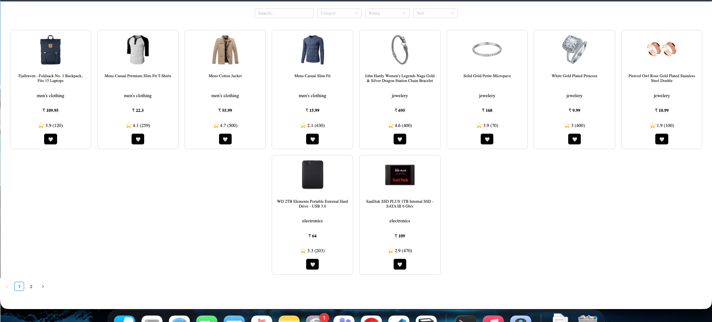

# 🛒 E-Commerce Product Listing App

A product browsing application built using React + TypeScript.  
Browse products, search, filter by category, sort by price, paginate results, and manage favorites — powered by a public products API.

🌐 Live Link: http://endearing-pie-f2d821.netlify.app/

---

## 📸 Screenshots

### Product Listing Page



## Getting Started

```bash
git clone https://github.com/saurav12797/e-com.git
cd ecommerce-app
npm install
npm run dev
```

Production build:

```bash
npm run build
npm run preview
```

---

## Tech Stack

| What                  | Why                                                    |
| --------------------- | ------------------------------------------------------ |
| React 19 + TypeScript | Type-safe component architecture                       |
| Vite                  | Fast development server and optimized production build |
| Context API           | Centralized application state                          |
| React Router          | Declarative routing                                    |
| Axios                 | HTTP client abstraction layer                          |
| Ant Design            | Ready-to-use UI components                             |
| SCSS                  | Component-scoped styling with nesting                  |

---

## 📁 Project Structure

```
src/
├── api/
│   └── axiosInstance.ts
├── constants/
│   └── product.constants.ts
├── context/
│   └── productContext.tsx
├── routes/
│   ├── routeConstants/
│   ├── AppRouter.tsx
│   └── routeConfig.tsx
├── services/
│   └── product.service.ts
├── styles/
├── types/
│   └── product.type.ts
└── views/
    └── Ecom/
        ├── ProductListing/
        ├── ProductFilter/
        ├── ProductCard/
        └── ProductDetails/
```

---

## ✨ Features

1. Paginated product grid
2. Server-side search using query parameters
3. Category filtering via API endpoint
4. Server-side price sorting (asc / desc)
5. Backend pagination using limit + skip
6. Favorites saved in localStorage
7. Loading state for all async operations
8. Error handling with toast notifications
9. Clean separation of concerns (service, context, UI)

---

## Component Breakdown

### ProductListing

1. Fetches products on filter or page change
2. Reads filters and page from Context
3. Sends limit and skip to backend
4. Renders product grid and pagination

---

### ProductFilter

1. Stateless UI component
2. Emits search, category, and sort updates
3. Uses controlled Select and Input components
4. Does not own business logic

---

### ProductCard

1. Displays product image, title, price, rating
2. Handles favorite toggle
3. Pure presentational component

---

### ProductContext

Single source of truth for:

1. products
2. loading state
3. filters
4. current page
5. favorites

Prevents duplicated state across components.

---

## Backend-Driven Filtering Strategy

All heavy operations handled server-side:

• Search → `/products/search?q=value`  
• Category → `/products/category/:category`  
• Sorting → `sort=asc | desc`  
• Pagination → `limit` and `skip`

Frontend sends:

```
limit = PAGE_SIZE
skip = (page - 1) * PAGE_SIZE
```

Backend returns only required data.  
No client-side slicing or duplicated dataset management.

---

## Future Improvements

1. Sync filters with URL parameters
2. Add caching layer
3. Add cart functionality
4. Improve test coverage
5. Optimize performance for large datasets

---

## AI Usage

1. Initial component scaffolding assisted by AI
2. Types modeled and verified manually
3. Architecture decisions reviewed and refined
4. All logic understood before final implementation

Rule followed throughout:

• AI assisted with drafts  
• All logic reviewed manually  
• No blind copy usage  
• Full ownership of code decisions

---
